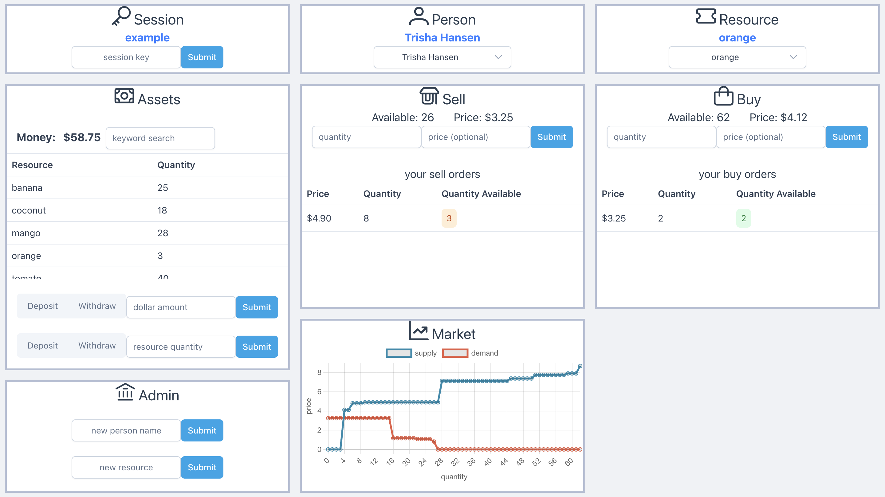

# market simulator

This is a web application that lets users buy and sell resources in a market. 

## Usage

Access the web app with this site  
https://mariusfacktor.github.io/market_simulator/

1) In the Session panel, type in a session key. This creates a new session or joins an existing one. 
2) In the Admin panel, create new people and new resources. 
3) Select a person and resource using Person and Resource panels.
4) The Assets panel shows the money and resources of the selected person. 
5) The Sell and Buy panels lets the selected person sell or buy the selected resource. Leave the price box blank to immediately sell or buy at market price, or pick your own price to create a limit order that will queue on the market. 

    

 

## Tech stack

Here I'll list the tools and components I used to build and host this web app. 

<ins>Backend</ins>

Sqlite  
SQLAlchemy ORM  
Flask  
Postman for testing HTTP API calls  
Gunicorn  
Nginx  
Google Cloud VM to host the backend server  
freedns.afraid.org to map the VM's external IP address to a domain name  
Let's Encrypt to create an SSL Certificate  

<ins>Frontend</ins>

Node.js  
Vue.js  
Axios to make HTTPS requests  
PrimeVue UI Component Library  
GitHub Pages to deploy the frontend  
